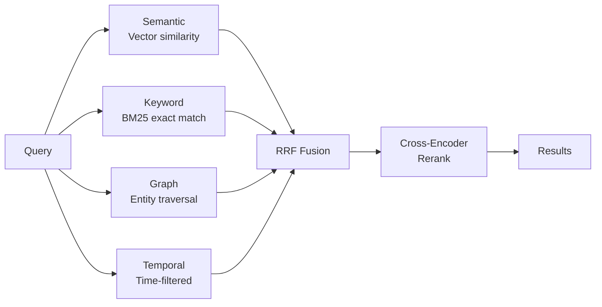

# Search Facts

Retrieve memories using multi-strategy search.

import Tabs from '@theme/Tabs';
import TabItem from '@theme/TabItem';

## Basic Search

<Tabs>
<TabItem value="python" label="Python">

```python
from hindsight_client import Hindsight

client = Hindsight(base_url="http://localhost:8888")

results = client.search(
    agent_id="my-agent",
    query="What does Alice do?"
)

for r in results:
    print(f"{r['text']} (score: {r['weight']:.2f})")
```

</TabItem>
<TabItem value="node" label="Node.js">

```typescript
import { OpenAPI, SearchService } from '@hindsight/client';

OpenAPI.BASE = 'http://localhost:8888';

const results = await SearchService.searchApiSearchPost({
    agent_id: 'my-agent',
    query: 'What does Alice do?'
});

for (const r of results.results) {
    console.log(`${r.text} (score: ${r.weight})`);
}
```

</TabItem>
<TabItem value="cli" label="CLI">

```bash
hindsight memory search my-agent "What does Alice do?"
```

</TabItem>
</Tabs>

## Search Parameters

| Parameter | Type | Default | Description |
|-----------|------|---------|-------------|
| `query` | string | required | Natural language query |
| `top_k` | int | 10 | Maximum results to return |
| `budget` | Budget | MID | Budget level: LOW (100), MID (300), HIGH (600) nodes |
| `fact_type` | list | all | Filter: `world`, `agent`, `opinion` |
| `max_tokens` | int | 4096 | Token budget for results |

<Tabs>
<TabItem value="python" label="Python">

```python
from hindsight_api.engine.memory_engine import Budget

results = client.recall(
    bank_id="my-agent",
    query="What does Alice do?",
    top_k=20,
    budget=Budget.HIGH,
    fact_type=["world", "agent"],
    max_tokens=8000
)
```

</TabItem>
</Tabs>

## Temporal Queries

Hindsight automatically detects time expressions and activates temporal search:

<Tabs>
<TabItem value="python" label="Python">

```python
# These queries activate temporal-graph retrieval
results = client.search(agent_id="my-agent", query="What did Alice do last spring?")
results = client.search(agent_id="my-agent", query="What happened in June?")
results = client.search(agent_id="my-agent", query="Events from last year")
```

</TabItem>
<TabItem value="cli" label="CLI">

```bash
hindsight memory search my-agent "What did Alice do last spring?"
hindsight memory search my-agent "What happened between March and May?"
```

</TabItem>
</Tabs>

Supported temporal expressions:

| Expression | Parsed As |
|------------|-----------|
| "last spring" | March 1 - May 31 (previous year) |
| "in June" | June 1-30 (current/nearest year) |
| "last year" | Jan 1 - Dec 31 (previous year) |
| "last week" | 7 days ago - today |
| "between March and May" | March 1 - May 31 |

## Filter by Fact Type

Search specific memory networks:

<Tabs>
<TabItem value="python" label="Python">

```python
# Only world facts (objective information)
world_facts = client.search_memories(
    agent_id="my-agent",
    query="Where does Alice work?",
    fact_type=["world"]
)

# Only agent facts (memory bank's own experiences)
agent_facts = client.search_memories(
    agent_id="my-agent",
    query="What have I recommended?",
    fact_type=["agent"]
)

# Only opinions (formed beliefs)
opinions = client.search_memories(
    agent_id="my-agent",
    query="What do I think about Python?",
    fact_type=["opinion"]
)

# World and agent facts (exclude opinions)
facts = client.search_memories(
    agent_id="my-agent",
    query="What happened?",
    fact_type=["world", "agent"]
)
```

</TabItem>
<TabItem value="cli" label="CLI">

```bash
hindsight memory search my-agent "Python" --fact-type opinion
hindsight memory search my-agent "Alice" --fact-type world,agent
```

</TabItem>
</Tabs>

## How Search Works

Search runs four strategies in parallel:



| Strategy | When it helps |
|----------|---------------|
| **Semantic** | Conceptual matches, paraphrasing |
| **Keyword** | Names, technical terms, exact phrases |
| **Graph** | Related entities, indirect connections |
| **Temporal** | "last spring", "in June", time ranges |

## Response Format

```python
{
    "results": [
        {
            "id": "550e8400-e29b-41d4-a716-446655440000",
            "text": "Alice works at Google as a software engineer",
            "context": "career discussion",
            "event_date": "2024-01-15T10:00:00Z",
            "weight": 0.95,
            "fact_type": "world"
        }
    ]
}
```

| Field | Description |
|-------|-------------|
| `id` | Unique memory ID |
| `text` | Memory content |
| `context` | Original context (if provided) |
| `event_date` | When the event occurred |
| `weight` | Relevance score (0-1) |
| `fact_type` | `world`, `agent`, or `opinion` |

## Budget Levels

The `budget` parameter controls graph traversal depth:

- **Budget.LOW (100 nodes)**: Fast, shallow search — good for simple lookups
- **Budget.MID (300 nodes)**: Balanced — default for most queries
- **Budget.HIGH (600 nodes)**: Deep exploration — finds indirect connections

```python
from hindsight_api.engine.memory_engine import Budget

# Quick lookup
results = client.recall(bank_id="my-agent", query="Alice's email", budget=Budget.LOW)

# Deep exploration
results = client.recall(bank_id="my-agent", query="How are Alice and Bob connected?", budget=Budget.HIGH)
```
