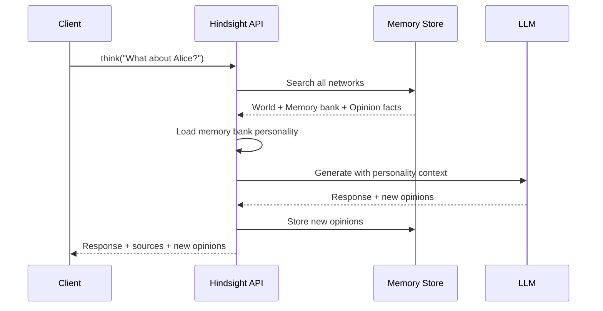

# Think

Generate personality-aware responses using retrieved memories.

import Tabs from '@theme/Tabs';
import TabItem from '@theme/TabItem';

## Basic Usage

<Tabs>
<TabItem value="python" label="Python">

```python
from hindsight_client import Hindsight

client = Hindsight(base_url="http://localhost:8888")

answer = client.think(
    agent_id="my-agent",
    query="What should I know about Alice?"
)

print(answer["text"])
```

</TabItem>
<TabItem value="node" label="Node.js">

```typescript
import { OpenAPI, ReasoningService } from '@hindsight/client';

OpenAPI.BASE = 'http://localhost:8888';

const response = await ReasoningService.thinkApiThinkPost({
    agent_id: 'my-agent',
    query: 'What should I know about Alice?'
});

console.log(response.text);
```

</TabItem>
<TabItem value="cli" label="CLI">

```bash
hindsight memory think my-agent "What should I know about Alice?"

# Verbose output shows reasoning and sources
hindsight memory think my-agent "What should I know about Alice?" -v
```

</TabItem>
</Tabs>

## Response Format

```python
{
    "text": "Alice is a software engineer at Google who joined last year...",
    "based_on": {
        "world": [
            {"text": "Alice works at Google", "weight": 0.95, "id": "..."}
        ],
        "agent": [],
        "opinion": [
            {"text": "Alice is very competent", "weight": 0.82, "id": "..."}
        ]
    },
    "new_opinions": [
        {"text": "Alice would be good for the ML project", "confidence": 0.75}
    ]
}
```

| Field | Description |
|-------|-------------|
| `text` | Generated response |
| `based_on` | Memories used, grouped by type |
| `new_opinions` | New opinions formed during reasoning |

## Parameters

| Parameter | Type | Default | Description |
|-----------|------|---------|-------------|
| `query` | string | required | Question or prompt |
| `budget` | Budget | LOW | Budget level: LOW (100), MID (300), HIGH (600) nodes |
| `top_k` | int | 10 | Max memories to retrieve |

<Tabs>
<TabItem value="python" label="Python">

```python
from hindsight_api.engine.memory_engine import Budget

answer = client.reflect(
    bank_id="my-agent",
    query="What do you think about remote work?",
    budget=Budget.MID
)
```

</TabItem>
</Tabs>

## What Think Does



1. **Retrieves** relevant memories from all three networks
2. **Loads** memory bank personality (Big Five traits + background)
3. **Generates** response influenced by personality
4. **Forms opinions** if the query warrants it
5. **Returns** response with sources and any new opinions

## Opinion Formation

Think can form new opinions based on evidence:

<Tabs>
<TabItem value="python" label="Python">

```python
answer = client.think(
    agent_id="my-agent",
    query="What do you think about Python vs JavaScript for data science?"
)

# Response might include:
# text: "Based on what I know about data science workflows..."
# new_opinions: [
#     {"text": "Python is better for data science", "confidence": 0.85}
# ]
```

</TabItem>
</Tabs>

New opinions are automatically stored and influence future responses.

## Personality Influence

The memory bank's personality affects Think responses:

| Trait | Effect on Think |
|-------|-----------------|
| High **Openness** | More willing to consider new ideas |
| High **Conscientiousness** | More structured, methodical responses |
| High **Extraversion** | More collaborative suggestions |
| High **Agreeableness** | More diplomatic, harmony-seeking |
| High **Neuroticism** | More risk-aware, cautious |

```python
# Create a memory bank with specific personality
client.create_agent(
    agent_id="cautious-advisor",
    background="I am a risk-aware financial advisor",
    personality={
        "openness": 0.3,
        "conscientiousness": 0.9,
        "neuroticism": 0.8,
        "bias_strength": 0.7
    }
)

# Think responses will reflect this personality
answer = client.think(
    agent_id="cautious-advisor",
    query="Should I invest in crypto?"
)
# Response will likely emphasize risks and caution
```

## Using Sources

The `based_on` field shows which memories informed the response:

```python
answer = client.think(agent_id="my-agent", query="Tell me about Alice")

print("Response:", answer["text"])
print("\nBased on:")
for fact in answer["based_on"]["world"]:
    print(f"  - {fact['text']} (relevance: {fact['weight']:.2f})")
```

This enables:
- **Transparency** — users see why the memory bank said something
- **Verification** — check if the response is grounded in facts
- **Debugging** — understand retrieval quality
