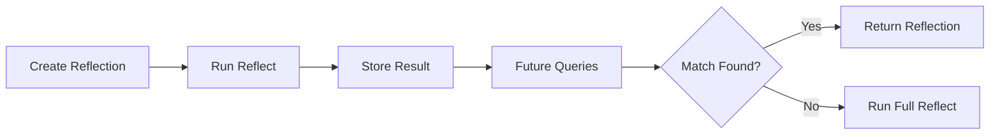

# Reflections

User-curated summaries that provide high-quality, pre-computed answers for common queries.

import Tabs from '@theme/Tabs';
import TabItem from '@theme/TabItem';
import CodeSnippet from '@site/src/components/CodeSnippet';

{/* Import raw source files */}
import reflectionsPy from '!!raw-loader!@site/examples/api/reflections.py';

## What Are Reflections?

Reflections are **saved reflect responses** that you curate for your memory bank. When you create a reflection, Hindsight runs a reflect operation with your source query and stores the result. During future reflect calls, these pre-computed summaries are checked first — providing faster, more consistent answers.



### Why Use Reflections?

| Benefit | Description |
|---------|-------------|
| **Consistency** | Same answer every time for common questions |
| **Speed** | Pre-computed responses are returned instantly |
| **Quality** | Manually curated summaries you've reviewed |
| **Control** | Define exactly how key topics should be answered |

### Hierarchical Retrieval

During reflect, the agent checks sources in priority order:

1. **Reflections** — User-curated summaries (highest priority)
2. **Mental Models** — Consolidated knowledge
3. **Raw Facts** — Ground truth memories

Reflections are checked first because they represent your explicitly curated knowledge.

---

## Create a Reflection

Creating a reflection runs a reflect operation in the background and saves the result:

<Tabs>
<TabItem value="python" label="Python">
<CodeSnippet code={reflectionsPy} section="create-reflection" language="python" />
</TabItem>
<TabItem value="cli" label="CLI">

```bash
# Create a reflection (async operation)
curl -X POST "http://localhost:8888/v1/default/banks/my-bank/reflections" \
  -H "Content-Type: application/json" \
  -d '{
    "name": "Team Communication Preferences",
    "source_query": "How does the team prefer to communicate?",
    "tags": ["team"]
  }'

# Response: {"operation_id": "op-123"}
# Use the operations endpoint to check completion
```

</TabItem>
</Tabs>

### Parameters

| Parameter | Type | Required | Description |
|-----------|------|----------|-------------|
| `name` | string | Yes | Human-readable name for the reflection |
| `source_query` | string | Yes | The query to run to generate content |
| `tags` | list | No | Tags for filtering during retrieval |
| `max_tokens` | int | No | Maximum tokens for the reflection content |

---

## List Reflections

<Tabs>
<TabItem value="python" label="Python">
<CodeSnippet code={reflectionsPy} section="list-reflections" language="python" />
</TabItem>
<TabItem value="cli" label="CLI">

```bash
curl "http://localhost:8888/v1/default/banks/my-bank/reflections"
```

</TabItem>
</Tabs>

---

## Get a Reflection

<Tabs>
<TabItem value="python" label="Python">
<CodeSnippet code={reflectionsPy} section="get-reflection" language="python" />
</TabItem>
<TabItem value="cli" label="CLI">

```bash
curl "http://localhost:8888/v1/default/banks/my-bank/reflections/{reflection_id}"
```

</TabItem>
</Tabs>

### Response Fields

| Field | Type | Description |
|-------|------|-------------|
| `id` | string | Unique reflection ID |
| `bank_id` | string | Memory bank ID |
| `name` | string | Human-readable name |
| `source_query` | string | The query used to generate content |
| `content` | string | The generated reflection text |
| `tags` | list | Tags for filtering |
| `last_refreshed_at` | string | When the reflection was last updated |
| `created_at` | string | When the reflection was created |
| `reflect_response` | object | Full reflect response including `based_on` facts |

---

## Refresh a Reflection

Re-run the source query to update the reflection with current knowledge:

<Tabs>
<TabItem value="python" label="Python">
<CodeSnippet code={reflectionsPy} section="refresh-reflection" language="python" />
</TabItem>
<TabItem value="cli" label="CLI">

```bash
curl -X POST "http://localhost:8888/v1/default/banks/my-bank/reflections/{reflection_id}/refresh"
```

</TabItem>
</Tabs>

Refreshing is useful when:
- New memories have been retained that affect the topic
- Mental models have been updated
- You want to ensure the reflection reflects current knowledge

---

## Update a Reflection

Update the reflection's name:

<Tabs>
<TabItem value="python" label="Python">
<CodeSnippet code={reflectionsPy} section="update-reflection" language="python" />
</TabItem>
<TabItem value="cli" label="CLI">

```bash
curl -X PATCH "http://localhost:8888/v1/default/banks/my-bank/reflections/{reflection_id}" \
  -H "Content-Type: application/json" \
  -d '{"name": "Updated Team Communication Preferences"}'
```

</TabItem>
</Tabs>

---

## Delete a Reflection

<Tabs>
<TabItem value="python" label="Python">
<CodeSnippet code={reflectionsPy} section="delete-reflection" language="python" />
</TabItem>
<TabItem value="cli" label="CLI">

```bash
curl -X DELETE "http://localhost:8888/v1/default/banks/my-bank/reflections/{reflection_id}"
```

</TabItem>
</Tabs>

---

## Use Cases

| Use Case | Example |
|----------|---------|
| **FAQ Answers** | Pre-compute answers to common customer questions |
| **Onboarding Summaries** | "What should new team members know?" |
| **Status Reports** | "What's the current project status?" refreshed weekly |
| **Policy Summaries** | "What are our security policies?" |

---

## Next Steps

- [**Reflect**](./reflect) — How the agentic loop uses reflections
- [**Mental Models**](/developer/mental-models) — How knowledge is consolidated
- [**Operations**](./operations) — Track async reflection creation
