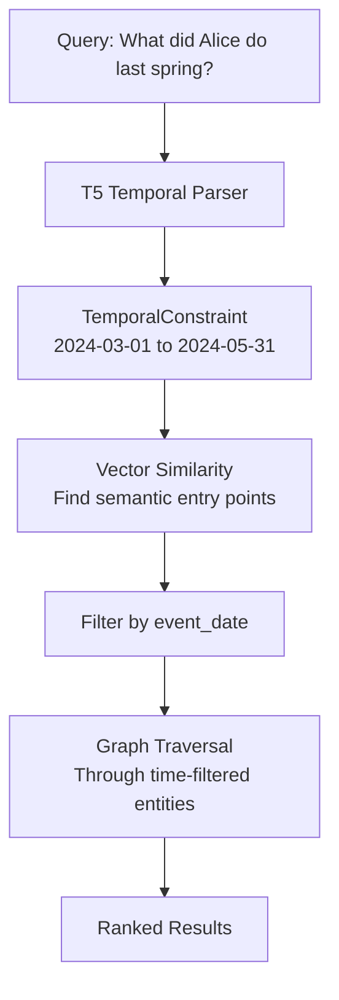

# Temporal Reasoning

Hindsight provides sophisticated temporal reasoning capabilities, allowing memory banks to understand and query memories based on when events occurred. This enables natural queries like "What did Alice do last spring?" or "What happened between March and May?"

## Overview

Temporal reasoning in Hindsight operates at two levels:

1. **Fact Storage**: Every memory can have an `event_date` timestamp indicating when the event occurred
2. **Query Analysis**: Natural language temporal expressions are automatically detected and parsed
3. **Temporal-Graph Retrieval**: A specialized retrieval strategy that filters memories by time range while maintaining entity relationships

## Storing Facts with Temporal Information

### Event Date Assignment

When ingesting facts, Hindsight extracts temporal information in the following order:

1. **Explicit `event_date` parameter**: If provided, this is used directly
2. **LLM-extracted date**: The fact extraction LLM identifies temporal markers in the content
3. **Default to storage time**: If no date is found, uses the current timestamp

```python
from hindsight_client import Hindsight
from datetime import datetime

client = Hindsight(base_url="http://localhost:8888")

# Explicit event date
client.put(
    agent_id="my-agent",
    content="Alice started working at Google",
    event_date=datetime(2023, 3, 15)
)

# LLM will extract the date from content
client.put(
    agent_id="my-agent",
    content="In June 2023, Alice moved to San Francisco"
)

# Falls back to current time
client.put(
    agent_id="my-agent",
    content="Alice likes Python"
)
```

### LLM Temporal Extraction

During fact extraction, the LLM identifies temporal markers in natural language:

| Input Content | Extracted Event Date |
|--------------|---------------------|
| "In March 2024, Alice started a new job" | March 1, 2024 00:00:00 |
| "Last spring, Bob learned Python" | March 1 (previous year) |
| "Yesterday I met with the team" | Yesterday's date |
| "Alice works at Google" | Current timestamp (no temporal marker) |

The extracted `event_date` is stored as a timestamp with the fact:

```sql
CREATE TABLE memory_units (
    id UUID PRIMARY KEY,
    text TEXT NOT NULL,
    event_date TIMESTAMP DEFAULT NOW(),
    -- other fields...
);
```

## Query-Time Temporal Analysis

### Automatic Detection

When a search query is issued, Hindsight automatically analyzes it for temporal expressions:

```python
# These queries activate temporal-graph retrieval
results = client.search(agent_id="my-agent", query="What did Alice do last spring?")
results = client.search(agent_id="my-agent", query="What happened in June?")
results = client.search(agent_id="my-agent", query="Events from last year")

# These do NOT activate temporal retrieval
results = client.search(agent_id="my-agent", query="What does Alice do?")
results = client.search(agent_id="my-agent", query="Tell me about Python")
```

### T5-Based Parsing

Hindsight uses a T5 transformer model (`google/flan-t5-small`) to convert natural language temporal expressions into structured date ranges:

```python
# Query: "What did Alice do last spring?"
#
# T5 Input Prompt:
# "Today is 2024-11-25. Convert temporal expressions to date ranges.
#  June 2024 = 2024-06-01 to 2024-06-30
#  last year = 2023-01-01 to 2023-12-31
#  What did Alice do last spring? ="
#
# T5 Generated Output:
# "2024-03-01 to 2024-05-31"
#
# Parsed Constraint:
# TemporalConstraint(
#     start_date=datetime(2024, 3, 1, 0, 0, 0),
#     end_date=datetime(2024, 5, 31, 23, 59, 59, 999999)
# )
```

### Supported Temporal Expressions

| Expression | Parsed Date Range | Notes |
|------------|------------------|-------|
| "last spring" | March 1 - May 31 (previous year) | Seasonal ranges |
| "in June" | June 1-30 (current/nearest year) | Specific month |
| "in June 2023" | June 1-30, 2023 | Month with year |
| "last year" | Jan 1 - Dec 31 (previous year) | Relative year |
| "last week" | 7 days ago - today | Relative week |
| "yesterday" | Yesterday's date (00:00 - 23:59) | Specific day |
| "between March and May" | March 1 - May 31 (current year) | Date range |
| "March 2023" | March 1-31, 2023 | Month and year |
| "2023" | Jan 1 - Dec 31, 2023 | Year only |

### No Temporal Expression

If no temporal expression is detected, the query analysis returns `None` and standard retrieval (without temporal filtering) is used:

```python
# No temporal expression detected
query = "What does Alice do?"
temporal_constraint = extract_temporal_constraint(query)
# Returns: None
```

## Temporal-Graph Retrieval Strategy

When a temporal constraint is detected, Hindsight activates the **Temporal-Graph** retrieval strategy as a 4th parallel search path.

### How It Works



### Algorithm Steps

```python
def retrieve_temporal(
    query_embedding,
    agent_id,
    start_date,
    end_date,
    budget,
    semantic_threshold=0.4
):
    """
    Temporal-Graph retrieval combines time filtering with entity relationships.

    Steps:
    1. Find semantic entry points (similarity >= threshold)
       WHERE event_date BETWEEN start_date AND end_date

    2. Initialize activation scores from similarity scores

    3. Graph traversal (spreading activation):
       - Follow entity links to related facts
       - ONLY traverse to facts within the time range
       - Propagate activation with decay (0.8x per hop)
       - Boost causal links (2x activation)

    4. Return facts sorted by activation score
    """
```

### SQL Query Example

```sql
-- Step 1: Find temporal entry points
WITH temporal_candidates AS (
    SELECT
        mu.id,
        mu.text,
        mu.event_date,
        1 - (mu.embedding <=> $query_embedding) AS similarity
    FROM memory_units mu
    WHERE mu.agent_id = $agent_id
      AND mu.fact_type = ANY($fact_types)
      AND mu.event_date >= $start_date
      AND mu.event_date <= $end_date
      AND (1 - (mu.embedding <=> $query_embedding)) >= $semantic_threshold
    ORDER BY similarity DESC
    LIMIT 10
)
-- Step 2 & 3: Graph traversal happens in Python code
-- walking through memory_links while enforcing temporal bounds
SELECT * FROM temporal_candidates;
```

### Key Differences from Standard Graph Traversal

| Aspect | Standard Graph | Temporal-Graph |
|--------|---------------|----------------|
| **Entry Points** | Top-K by similarity (any time) | Top-K by similarity **within time range** |
| **Traversal** | Follow all entity links | Only follow links to **facts within time range** |
| **Use Case** | "What does Alice do?" | "What did Alice do last spring?" |
| **Activation Source** | Pure semantic similarity | Time-filtered semantic similarity |

### Example Walkthrough

**Query**: "What did Alice do last spring?"

**Step 1 - Temporal Parsing:**
```python
temporal_constraint = extract_temporal_constraint(query)
# Result: (2024-03-01 00:00:00, 2024-05-31 23:59:59)
```

**Step 2 - Find Entry Points:**
```
Semantic search for "What did Alice do"
WHERE event_date BETWEEN '2024-03-01' AND '2024-05-31'

Found:
- "Alice started learning Rust" (April 15, 2024, similarity: 0.78)
- "Alice attended ML conference" (May 3, 2024, similarity: 0.72)
```

**Step 3 - Graph Traversal (time-filtered):**
```
From "Alice started learning Rust":
  → Alice (entity)
    → "Alice joined Rust meetup" (April 20, 2024) ✓ within range
    → "Alice published Rust blog post" (April 28, 2024) ✓ within range
    → "Alice works at Google" (Jan 2023) ✗ outside range, skip

From "Alice attended ML conference":
  → ML Conference (entity)
    → "Conference keynote on LLMs" (May 3, 2024) ✓ within range
  → Alice (entity)
    → Same as above
```

**Step 4 - Activation Scores:**
```
1. "Alice started learning Rust" (0.78) - direct match
2. "Alice attended ML conference" (0.72) - direct match
3. "Alice published Rust blog post" (0.78 × 0.8 = 0.62) - 1 hop
4. "Alice joined Rust meetup" (0.78 × 0.8 = 0.62) - 1 hop
5. "Conference keynote on LLMs" (0.72 × 0.8 = 0.58) - 1 hop
```

## Integration with Multi-Strategy Retrieval

Temporal-Graph runs **in parallel** with the other three strategies:

```python
# When temporal constraint detected:
results = await asyncio.gather(
    retrieve_semantic(query_embedding, agent_id, fact_types),
    retrieve_bm25(query, agent_id, fact_types),
    retrieve_graph(query_embedding, agent_id, fact_types, budget),
    retrieve_temporal(query_embedding, agent_id, fact_types,
                     start_date, end_date, budget)  # 4th strategy
)

# Fusion via RRF
fused = reciprocal_rank_fusion(results)

# Rerank with temporal awareness
final = cross_encoder_rerank(query, fused, include_dates=True)
```

The 4th strategy (Temporal-Graph) contributes additional ranked results to the fusion process, ensuring that time-relevant facts are strongly represented in the final results.

## Cross-Encoder Temporal Awareness

The cross-encoder reranker receives temporal context for more accurate relevance scoring:

```python
# Standard input:
cross_encoder.predict([
    (query, memory_text)
])

# With temporal awareness:
cross_encoder.predict([
    (query, f"[Date: {date_readable}] {memory_text}")
])

# Example:
# Query: "What did Alice do last spring?"
# Input to cross-encoder:
# ("What did Alice do last spring?",
#  "[Date: April 15, 2024] Alice started learning Rust")
```

This allows the reranker to boost facts that align with the query's temporal intent.

## Performance Considerations

### Latency

| Component | Typical Latency | Notes |
|-----------|----------------|-------|
| T5 temporal parsing | ~30-80ms (CPU) | Cached for repeated queries |
| Temporal entry point search | ~25-40ms | PostgreSQL query with time+vector filter |
| Time-filtered graph traversal | ~35-60ms | Similar to standard graph, fewer candidates |
| **Total temporal overhead** | **~50-120ms** | Only when temporal expressions detected |

### Optimization Tips

1. **Event Date Indexing**: Ensure `event_date` column is indexed:
```sql
CREATE INDEX idx_memory_units_event_date
ON memory_units (event_date)
WHERE event_date IS NOT NULL;
```

2. **Composite Index**: For frequent temporal queries:
```sql
CREATE INDEX idx_memory_units_agent_temporal
ON memory_units (agent_id, event_date, fact_type);
```

3. **T5 Model Caching**: The model is loaded once and reused across queries

## API Reference

### Python Client

```python
from hindsight_client import Hindsight
from datetime import datetime

client = Hindsight(base_url="http://localhost:8888")

# Store with explicit event date
client.put(
    agent_id="my-agent",
    content="Event content",
    event_date=datetime(2024, 3, 15)
)

# Search with natural language temporal expression
results = client.search(
    agent_id="my-agent",
    query="What happened last spring?"
)

# Results include event_date
for r in results:
    print(f"{r['text']} (date: {r['event_date']})")
```

### REST API

```bash
# Store with event date
curl -X POST http://localhost:8888/api/v1/put \
  -H "Content-Type: application/json" \
  -d '{
    "agent_id": "my-agent",
    "content": "Alice started new job",
    "event_date": "2024-03-15T10:00:00Z"
  }'

# Search (temporal parsing automatic)
curl -X POST http://localhost:8888/api/v1/search \
  -H "Content-Type: application/json" \
  -d '{
    "agent_id": "my-agent",
    "query": "What did Alice do last spring?"
  }'
```

## Advanced: Temporal Ranges in Memory bank Profiles

Memory banks can have temporal ranges that represent their active periods or episodic boundaries:

```python
# Create agent with temporal range
client.create_agent(
    agent_id="my-agent",
    name="Alice",
    temporal_ranges=[
        {
            "start_date": "2023-01-01T00:00:00Z",
            "end_date": "2023-12-31T23:59:59Z",
            "description": "2023 academic year"
        },
        {
            "start_date": "2024-01-01T00:00:00Z",
            "end_date": "2024-12-31T23:59:59Z",
            "description": "2024 academic year"
        }
    ]
)
```

These ranges can be used to:
- Segment memories into distinct time periods
- Filter retrieval to specific life phases
- Support episodic memory queries

## Limitations and Future Work

### Current Limitations

1. **Relative Dates**: "yesterday", "last week" are resolved relative to query time, not event time
2. **Duration Expressions**: "for 3 months" or "during the conference" not fully supported
3. **Fuzzy Temporal**: "around June" or "early spring" treated as exact boundaries
4. **Recurring Events**: "every Monday" or "annual conference" not handled specially

### Planned Enhancements

- Duration-based queries ("events lasting more than a week")
- Temporal relationship extraction ("after Alice joined Google", "before the conference")
- Recurrence pattern recognition
- Relative temporal reasoning ("what happened next")

## Summary

Hindsight's temporal reasoning capabilities enable natural, time-aware memory queries:

✅ **Automatic fact timestamping** - LLM extracts dates from content
✅ **Natural language parsing** - T5 converts "last spring" to date ranges
✅ **Temporal-Graph retrieval** - 4th parallel strategy for time-filtered search
✅ **Cross-encoder awareness** - Reranker considers temporal alignment
✅ **Low overhead** - Only activates when temporal expressions detected

This allows memory banks to answer complex temporal queries like:
- "What did I learn last quarter?"
- "What was Alice working on in March?"
- "Events between the conference and the project launch"
